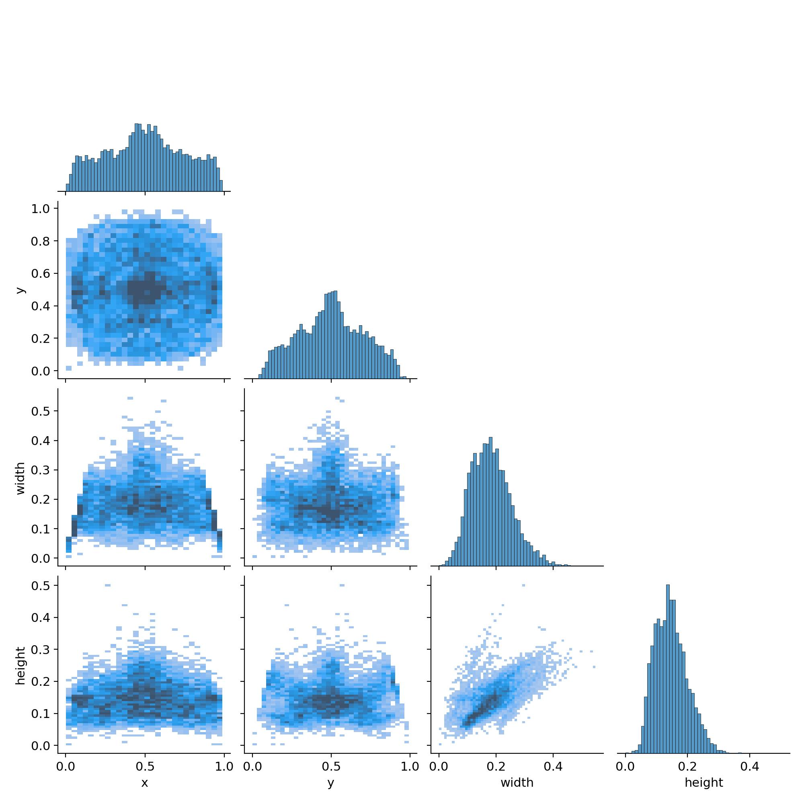
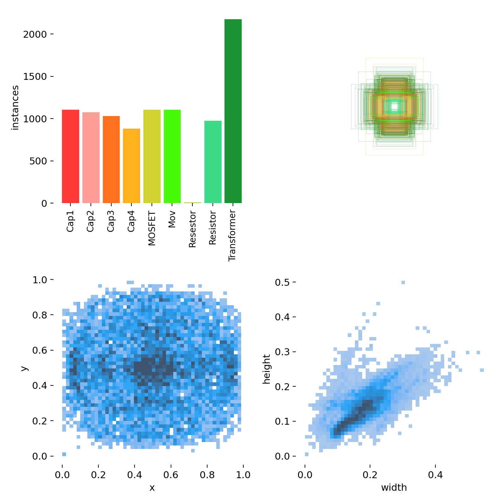
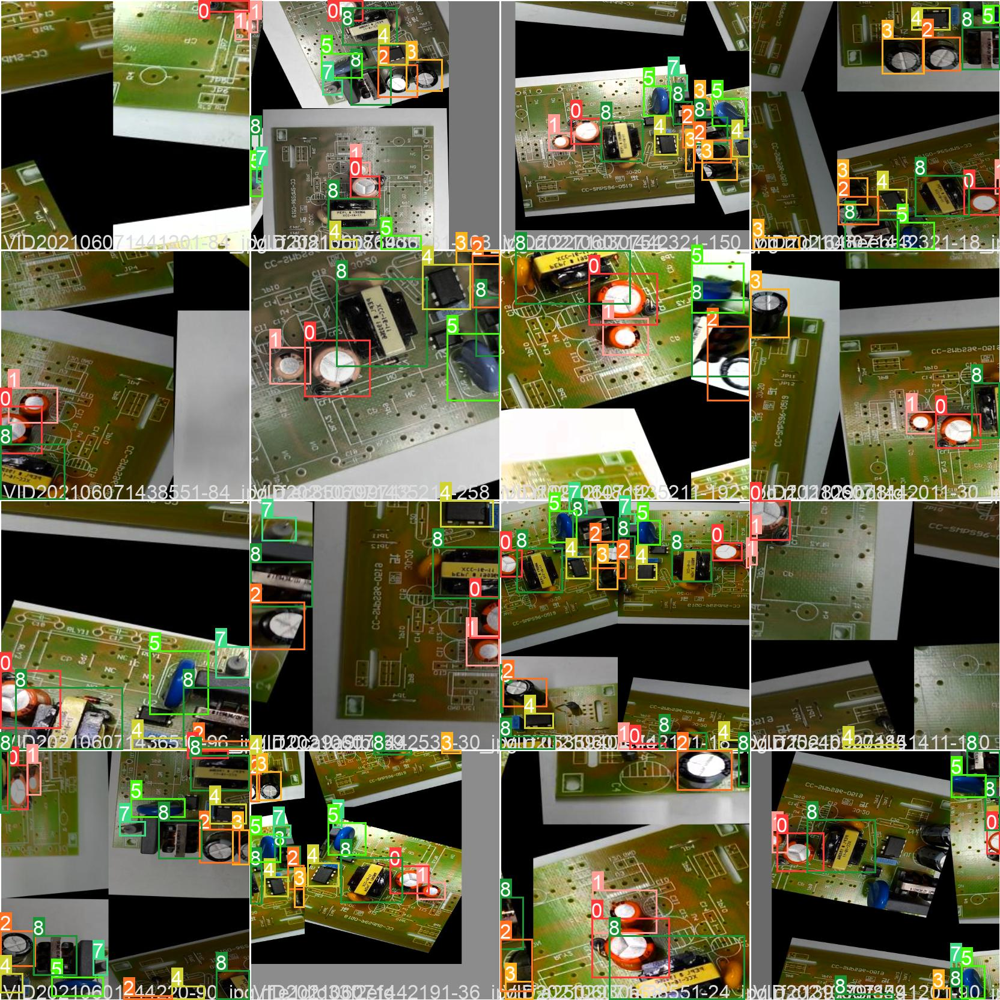
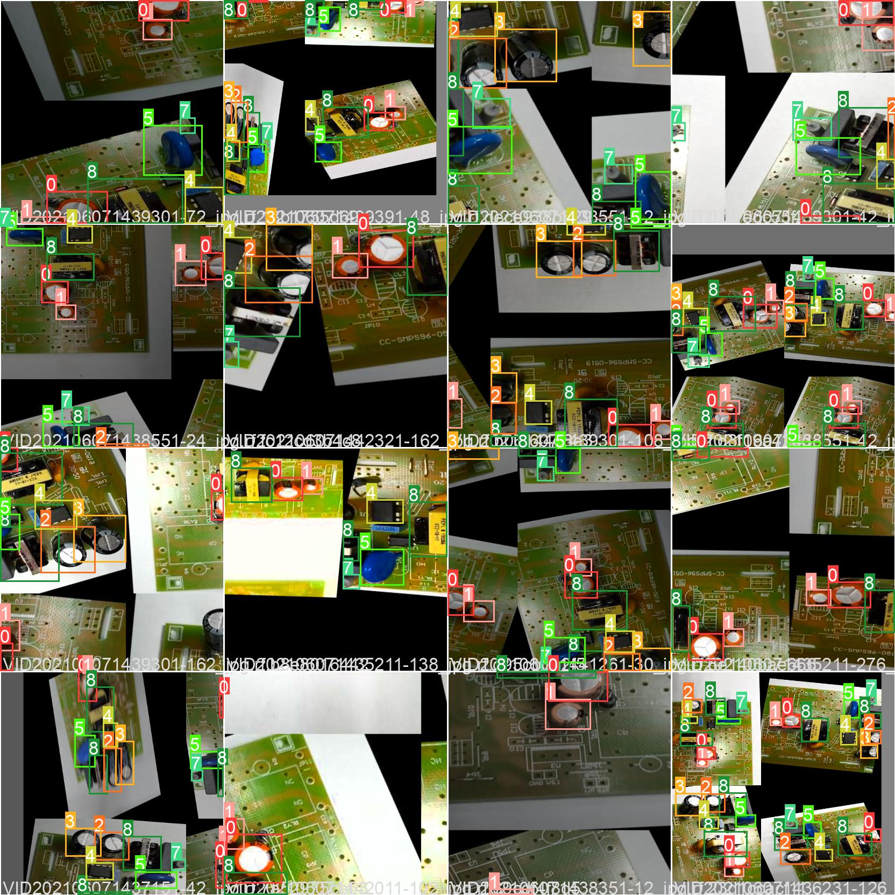
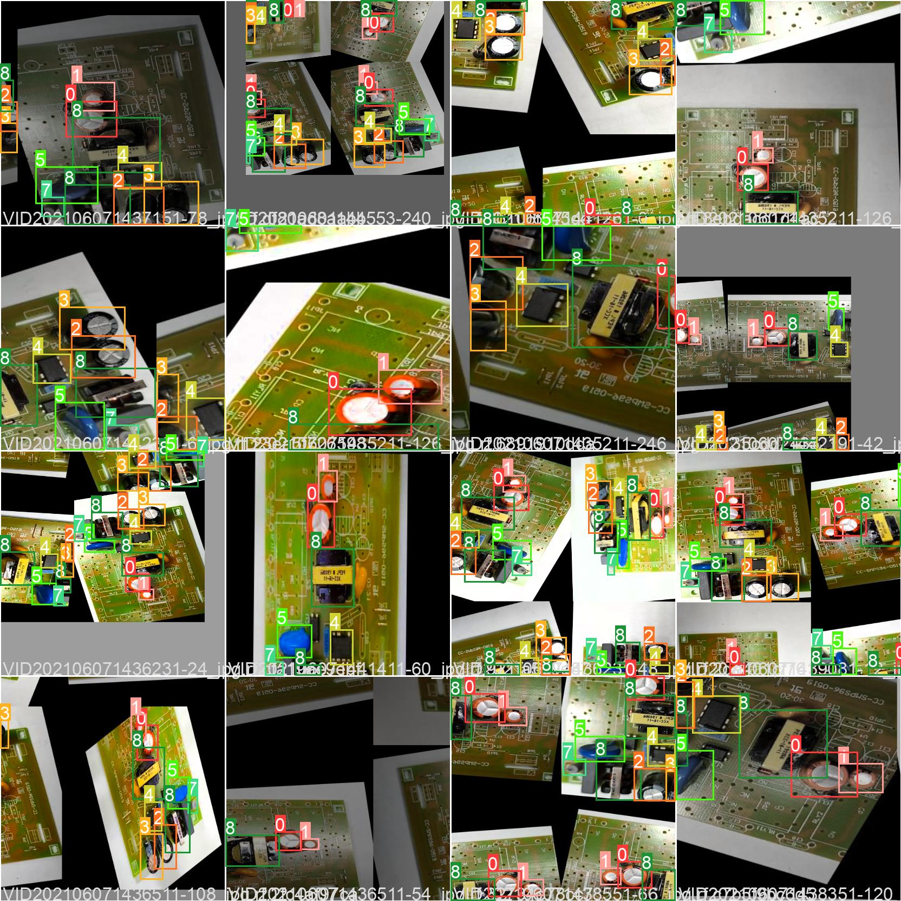

# pcb component detection/recognition

This code shows the train and test of a YOLOV5 convolutional neural network for recognition of electronics components

see the model working on video: <a href="https://www.linkedin.com/embed/feed/update/urn:li:ugcPost:6893204326802948096">here</a>


## 🔥 SETUP

download the folder and upload to your google drive put in a dir named /Real_PCB/Databset/ :

<a href="https://drive.google.com/drive/folders/1odzD298ImaHI3NKozQNGIgKbflzgSWIn?usp=sharing">here</a> it's the dataset originaly created by Animeshkumar Nayak(available on Kaggle) with some improvements that i made in roboflow

This is how should look the projet struture :  
```
MyDrive/
└── Real_PCB/
    ├── Dataset/
    │   └── pcb_data/
    │       ├── data.yaml     
    │       ├── test/
    │       ├── valid/
    │       └── train/
    │   
    └── yolov5/
```
### THE TRAIN 

I chose to train on colab cause i havent a powerfull GPU as colab invidia does and its free :)

The train process is all commented 

### THE TEST

To test the models you only need the results. its also commented 

yolov5 allows you to test the model using videos images even your web camera if you setup it your machine    

### ABOUT THE RESULTS 

<p align="center">(see the short video demo: <a href="https://www.linkedin.com/embed/feed/update/urn:li:ugcPost:6893204326802948096">here</a>)</p>
<br>
<p align="center">
  
  
</p>


<p align="center">
      &nbsp
      &nbsp
      
</p>
